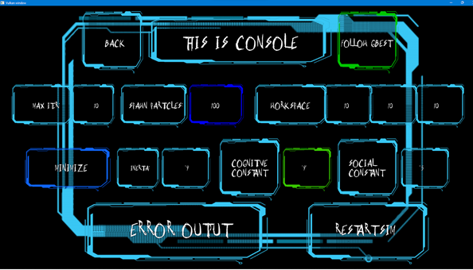
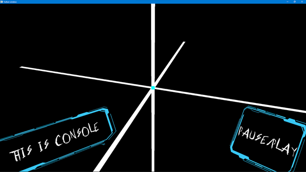
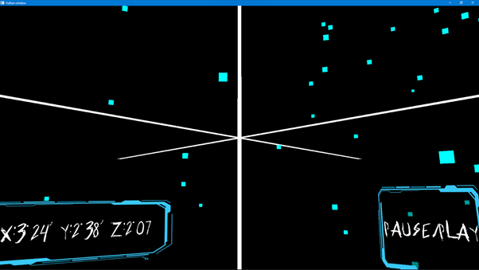
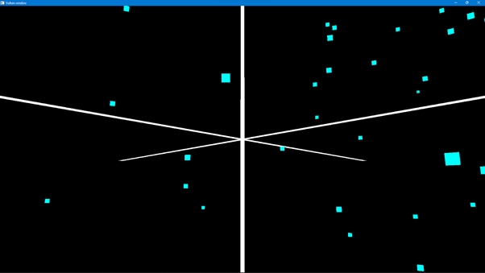
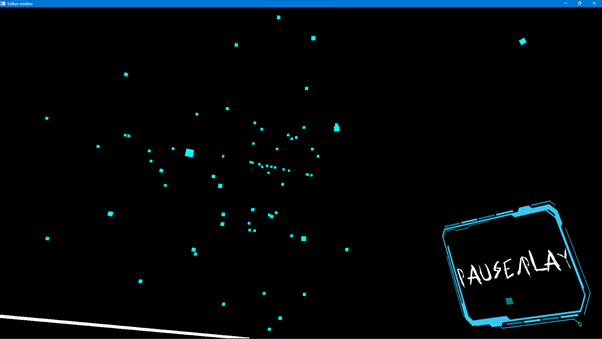
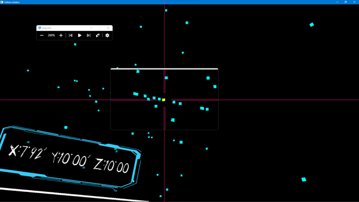
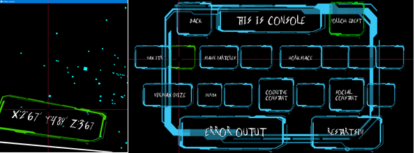
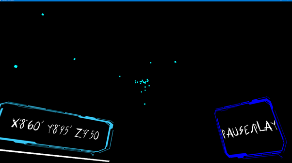
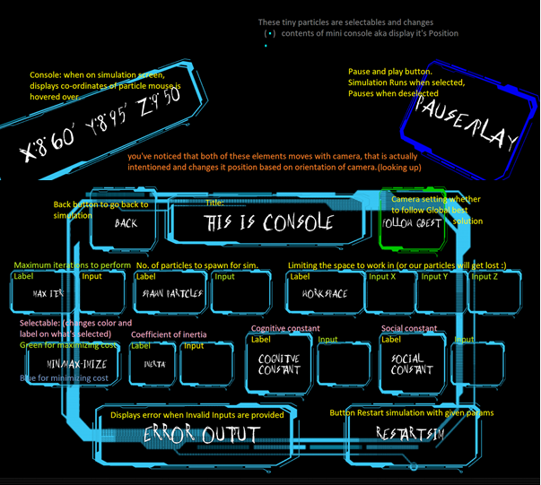

# Vulkan Test - Particle Swarm Optimization
this is me learning vulkan and playing with it.

Main menu/Console:  
  
Simulation Space:  
  
Simulation Running:  
  
Paused Full-screen:  
  
Now Camera following G-Best  
  
Displaying Location of Particle on console:  
  
Opening the Console again:  
  
Particle converging in simulation:  
  
Explaining various UI elements:  
  

Note: cognitive constant is controls personal influence, social constant controls social influence  
 
dependencies:
> CMake,  
> vcpkg,  
> vulkan (LunarG reccommended),  
> C++ 20 compatible compiler (with modules support)  
> powershell (mine: 7.2.3)  

Objectives:
> Cpp20  
> Vulkan expertise  

Note:  
<tr> Look into older commits for more information on specifics for corresponding files (why doing somthing that way)