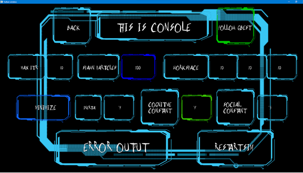

# Vulkan Test - Particle Swarm Optimization
this is me learning vulkan and playing with it.

Main menu/Console:

Simulation Space: 

Simulation Running:
 Paused Full-screen: 
Now Camera following G-Best Displaying Location of Particle on console: 

Opening the Console again:
  
Particle converging in simulation: 
Explaining various UI elements:  
Note: cognitive constant is controls personal influence, social constant controls social influence

dependencies:
> CMake,  
> vcpkg,  
> vulkan (LunarG reccommended),  
> C++ 20 compatible compiler (with modules support)  
> powershell (mine: 7.2.3)  

Objectives:
> Cpp20  
> Vulkan expertise  

Note:  
<tr> Look into older commits for more information on specifics for corresponding files (why doing somthing that way)